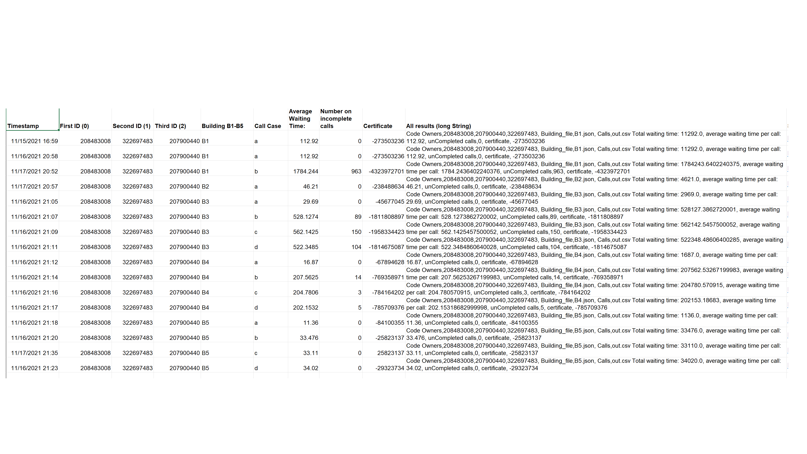
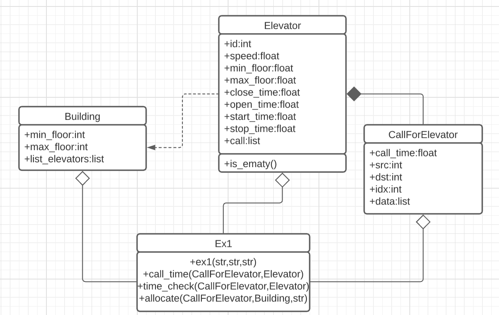

# Readme

#### Hand in by 208483008,322697483 and 207900440

## preface

This is a readme for our oop-Ex1- offline elevator algorithm.
Please follow those instructions:
1. In section “2. Literature research” you can read our literary research.
2. In section “3. Algorithm” you can read our concept of our offline elevator algorithm.
3. In section “4. Dependencies” you can find which libraries is in the base of our algorithm/
4. In section “5. Timetable” you can see our results for the examples that we got from simulator.
5. In section “6. UML” there is our UML of our whole class
6. In section "7. How to run the algorithm and tests" you can find instruction how to run the programs.
7. Run the jar file with our code to test our performance.
8. Have fun!

## 2. Literature research

Offline elevators Algorithm Optimization is one of the most discussable topics in the Computer Science Researchers.
After we researched to learn more about the Offline Elevators Algorithm Optimization we have found few relevant and interesting article, researches and video and there is our finding:

#### First article

This article purpose is to present complexity optional point of view of calculating Time Algorithms, and the differences between them. In the article there a brief summary of FCFS and SSTF – both different of a logical approach of allocating elevator. 
There is a presentation of LOOK and SCAN algorithms that works similarly but LOOK is a bit better than SCAN. 

* SCAN algorithm - is by going in one direction and handle all the calls there is at that direction and then change to the other direction and handle all the call at the other direction/
* Look algorithm - is more efficient due to its stops. If it doesn't have more calls at that direction he is in at a specific time it change its direction and handle the calls in the other direction.
* SAFT algorithm - calculating the time the customer had spent in the elevator as well.

#### Second article

This article is presenting in very simplify way and dealing with more generally subject surrounding tour topic. In the article is mention that today a lot of the elevators algorithms nowadays using AI to determent which way is the best way for this specific building algorithm.
There is even a video (source no. 5) that emphasize it and presenting a similar discussion with different types of building and elevators like our HW.

#### Third article

This article is a comparison between the five known Elevators algorithm before the current millennia:
1. MRF-Maximum Request First
2. FRF- First Request First
3. RAND-Random
4. CIRC -Circular
5. SDF - Shortest Destination First 


This comparison helps us to understand the importance of logic using and planning before one start to execute project at this huge size

#### Fourth article

This research is more widely speaking logically of the meaning of smart elevators. From the basics (at least today) like cyber defense for elevators and to calculating the expectancy of the efficiency calls by AI algorithm and personalization of the elevators for specific clients. The whole research is about efficiency in cases there is more than one elevator, because when we have only one elevator the work would be much simpler.

Bibliography:
1. https://cdmana.com/2021/02/20210202111024127g.html
2. https://www.popularmechanics.com/technology/infrastructure/a20986/the-hidden-science-of-elevators/
3. https://nanopdf.com/download/comparative-study-of-on-line-algorithms-for-the-elevator-scheduling_pdf
4. https://www.bjmc.lu.lv/fileadmin/user_upload/lu_portal/projekti/bjmc/Contents/8_4_12_Robal.pdf
5. Short video that presents in very vivid way: 
                                    [The science Behind Elevators](https://www.youtube.com/watch?v=xOayymoIl8U)

            

## 3. The algorithm

Our algorithm run on all the calls.
For each call we run on all the elevators in the given building.
Then for each elevator we calculate the approx time this elevator will arrive to the source call (depends on the previous calls).
The call will assign to the 'fastest time to source' elevator.

Each elevator have a list called "calls" where we save all the calls assigned to this elevator.
Each call have a list called "data" where we save the assigned elevator, approx time the elevator will reach the source floor and approx time to finish the call.
With those lists we can get for each elevator the last call we assigned to this elevator and the approx times for each call.

## 4. Dependencies 

Those are the libraries we are using in our algorithm. Please make sure you have them updated for use our algorithm correctly:

* csv library - [documentation](https://docs.python.org/3/library/csv.html)
* json library - [documentation](https://docs.python.org/3/library/json.html)
* sys library - [documentation](https://docs.python.org/3/library/sys.html)

## 5. Timetable


## 6. UML


## 7. How to run the algorithm and the tests

How to rum our algorithm from the CMD:

```bash
python Ex1.py <Building.json> <Calls.csv> <output.csv>
```
To run the tests just go to the cmd and run this command line:
```cmd
java -jar Ex1_checker_V1.2_obf.jar 208483008,322697483,207900440 <Building.json> <Calls.csv> <output.csv>
```
you can also run manually our tests for our algorithm and function in the file Tests.py
